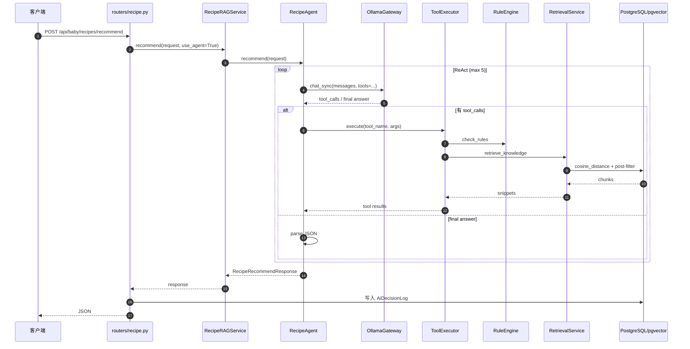
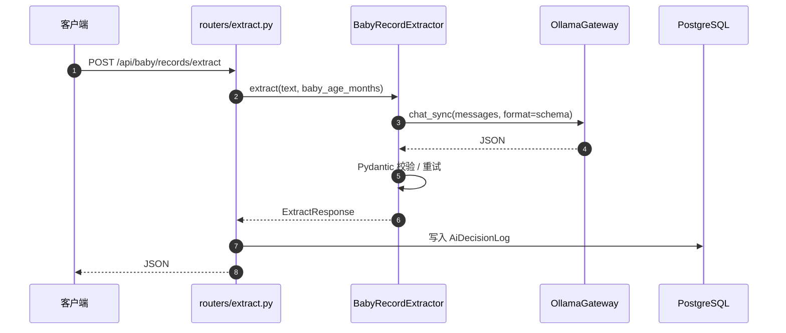

# baby-grow-ai Python 类调用关系图

> 生成时间：2026-09-16
> 范围：`babyGrowAi/src/app/**/*.py`

```mermaid
flowchart TB
    subgraph FastAPI["FastAPI 入口层 (routers)"]
        REC["🟦 routers/recipe.py<br/>POST /api/baby/recipes/recommend"]
        EXT["🟦 routers/extract.py<br/>POST /api/baby/records/extract"]
    end

    subgraph Service["服务层 (services)"]
        RAG["🟩 RecipeRAGService<br/>recipe_rag.py"]
        AGENT["🟩 RecipeAgent<br/>agent/react.py"]
        EXTRACTOR["🟩 BabyRecordExtractor<br/>extractor.py"]
        GATEWAY["🟩 OllamaGateway<br/>services/ollama_gateway.py"]
        EMB["🟩 EmbeddingService<br/>services/embedding.py"]
        RET["🟩 RetrievalService<br/>services/retrieval.py"]
        RULES["🟩 RuleEngine<br/>services/rules.py"]
        TOOLS["🟩 ToolExecutor<br/>agent/tools.py"]
    end

    subgraph Model["模型/数据层 (models)"]
        PYDANTHON["📦 Pydantic Request/Response Schemas"]
        SQL["🗄️ SQLAlchemy ORM Tables"]
    end

    subgraph ConfigDB["配置与数据库"]
        CFG["⚙️ Settings<br/>config.py"]
        DB["🗄️ db_session / get_db<br/>db.py"]
    end

    subgraph Prompts["提示词模块"]
        RP["recipe prompts<br/>prompts/recipe.py"]
        EP["extraction prompts<br/>prompts/extraction.py"]
        AP["agent prompts<br/>agent/prompts.py"]
    end

    subgraph Ingest["知识库构建"]
        ING["knowledge/ingest.py"]
    end

    REC -->|调用 recommend(request, use_agent=True) | RAG
    RAG -->|默认走 ReAct| AGENT
    RAG -->|use_agent=False 走固定链路| RAG_FIX["固定链路: rule→retrieve→LLM→JSON"]
    AGENT -->|调用工具| TOOLS
    AGENT -->|请求 LLM| GATEWAY
    TOOLS -->|check_rules| RULES
    TOOLS -->|retrieve_knowledge| RET
    TOOLS -->|get_recent_diet| MOCK["内存 mock 饮食记录"]
    RET -->|向量/相似度检索| DB
    RET -->|embedding| EMB
    EMB -->|调用 embed| GATEWAY
    RULES -->|无 DB, 纯内存规则| RULES
    EXT -->|调用 extract| EXTRACTOR
    EXTRACTOR -->|chat_sync + JSON schema| GATEWAY
    EXTRACTOR -->|使用提示| EP
    RAG -->|使用提示| RP
    AGENT -->|使用提示| AP
    RAG -->|source_refs| PYDANTHON
    EXTRACTOR -->|返回| PYDANTHON
    REC -->|写入审计日志| SQL
    EXT -->|写入审计日志| SQL
    CFG -->|所有模块读取| RAG
    CFG -->|读取| GATEWAY
    CFG -->|读取| RET
    CFG -->|读取| EXTRACTOR
    ING -->|写入| SQL
```

## 类清单与作用速查

| 类名 | 文件路径 | 作用说明 |
|------|---------|---------|
| `Settings` | `app/config.py` | 统一管理环境变量与配置（PG DSN、Ollama 地址、模型名、超时等） |
| `RecipeRAGService` | `app/recipe_rag.py` | 配餐推荐高层服务，默认走 ReAct Agent，可回退固定流水线 |
| `RecipeAgent` | `app/agent/react.py` | ReAct Agent 核心，通过 Ollama 原生 tool calling 编排工具调用 |
| `ToolExecutor` | `app/agent/tools.py` | 执行 Agent 调用的三个工具：check_rules、retrieve_knowledge、get_recent_diet |
| `RuleEngine` | `app/services/rules.py` | 确定性安全规则：月龄、过敏原、质地建议 |
| `RetrievalService` | `app/services/retrieval.py` | 基于 pgvector 的向量检索，后按年龄/过敏原/质地过滤 |
| `EmbeddingService` | `app/services/embedding.py` | 文本嵌入服务，封装 Ollama embedding 接口 |
| `OllamaGateway` | `app/services/ollama_gateway.py` | Ollama SDK 网关：chat / embed / health，支持 tools、format、stream |
| `BaseModelGateway` | `app/services/ollama_gateway.py` | 网关抽象基类，预留外部模型接入点 |
| `BabyRecordExtractor` | `app/extractor.py` | 从家长自由文本中提取结构化记录（里程碑、饮食、奶量、睡眠、情绪） |
| `MilestoneRecord` | `app/models.py` | 里程碑记录 Pydantic 模型 |
| `FoodRecord` | `app/models.py` | 饮食记录 Pydantic 模型 |
| `MilkRecord` | `app/models.py` | 奶量记录 Pydantic 模型 |
| `SleepRecord` | `app/models.py` | 睡眠记录 Pydantic 模型 |
| `MoodRecord` | `app/models.py` | 情绪记录 Pydantic 模型 |
| `ExtractionResult` | `app/models.py` | 提取结果聚合模型 |
| `ExtractRequest` / `ExtractResponse` | `app/models.py` | 提取接口请求/响应模型 |
| `RecipeRecommendRequest` / `RecipeRecommendResponse` | `app/models.py` | 配餐推荐请求/响应模型 |
| `RecipeItem` | `app/models.py` | 推荐菜品单项模型 |
| `SourceRef` | `app/models.py` | 知识库引用来源模型 |
| `KnowledgeDocument` | `app/models.py` | 知识文档元数据表 |
| `KnowledgeChunk` | `app/models.py` | 带向量 embedding 的知识分片表 |
| `Recipe` | `app/models.py` | 结构化食谱表 |
| `RecipeIngredient` | `app/models.py` | 食谱食材关联表 |
| `AiDecisionLog` | `app/models.py` | AI 决策审计日志表 |

## 推荐链路数据流



## 提取链路数据流



## 颜色约定

- 🟦 FastAPI Router / 入口
- 🟩 Service / 业务逻辑核心
- 📦 Pydantic 数据模型
- 🗄️ 数据持久化（SQLAlchemy / PostgreSQL）
- ⚙️ 配置与工具
