# 宝宝成长记录 · AI 系统架构与数据流总图

> 版本：基于当前代码实现（Phase 1-5）
> 覆盖范围：微信小程序前端、Java 后端、Python AI 服务、Ollama 本地模型、PostgreSQL 知识库

---

## 一、总体系统架构

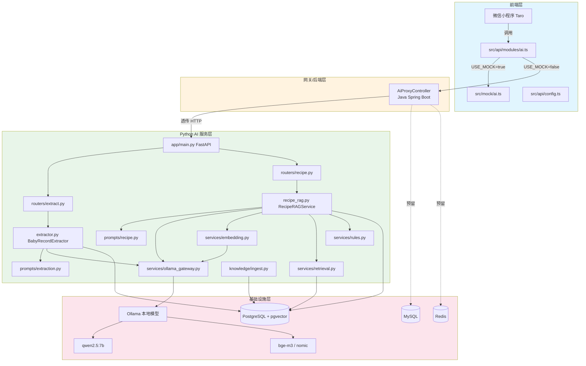

### 架构说明

| 层级 | 组件 | 职责 |
|------|------|------|
| 前端层 | 微信小程序 + `ai.ts` + `mock/ai.ts` | 发起 AI 请求，支持 mock 调试 |
| 后端层 | `AiProxyController` | 透传前端请求到 Python AI 服务，隐藏 AI 细节 |
| AI 服务层 | FastAPI + routers + services | 文本提取、食谱推荐、知识库管理 |
| 基础设施层 | Ollama、PostgreSQL/pgvector、MySQL、Redis | 模型推理、向量检索、业务数据、缓存 |

---

## 二、文本智能提取模块数据流

### 2.1 时序图

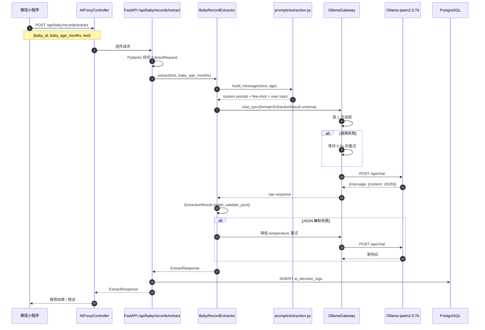

### 2.2 类调用链

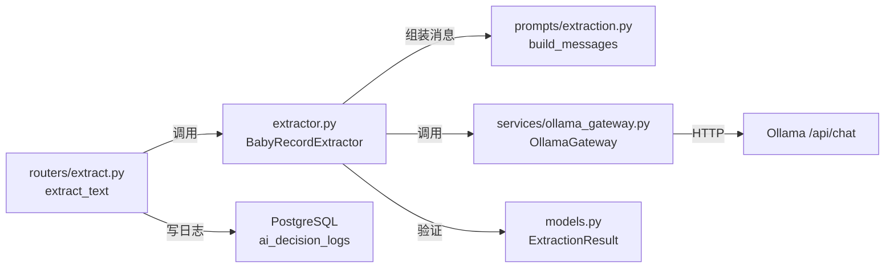

### 2.3 数据流转说明

1. 前端发送 `{baby_id, baby_age_months, text}`。
2. `AiProxyController` 透传到 Python AI 服务。
3. `ExtractRequest` 校验后交给 `BabyRecordExtractor`。
4. `build_messages()` 拼接 system prompt + few-shot 示例 + 真实输入。
5. `OllamaGateway.chat_sync()` 调用 Ollama，强制 `format=ExtractionResult.schema`。
6. 返回 JSON 被 Pydantic 校验为 `ExtractionResult`。
7. 解析失败时自动重试 1 次（降低 temperature）。
8. 最终写入 `ai_decision_logs`，返回 `ExtractResponse`。

---

## 三、食谱 RAG 推荐模块数据流

### 3.1 时序图

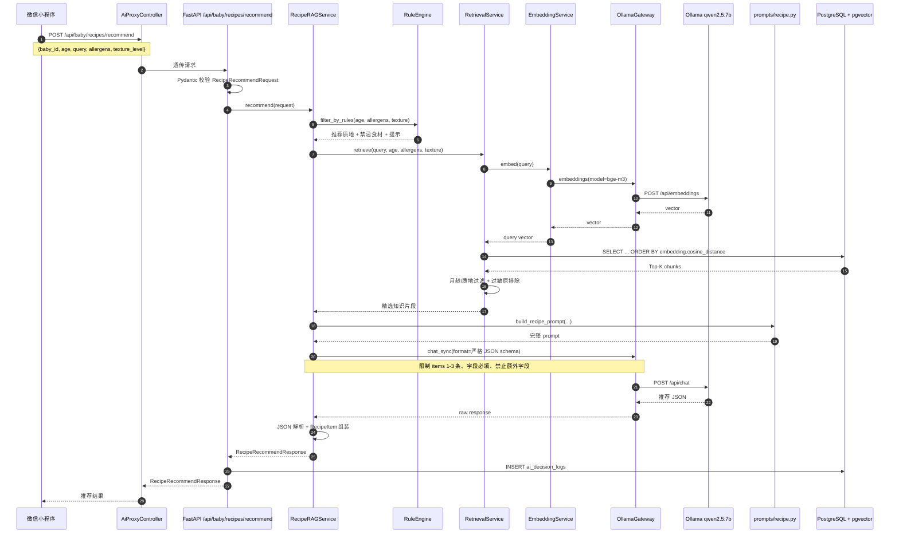

### 3.2 类调用链

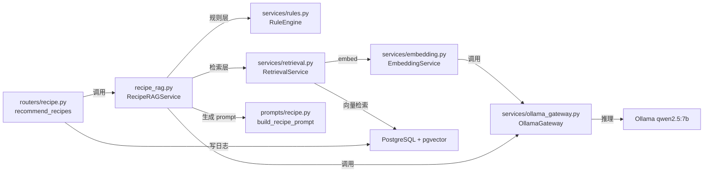

### 3.3 三层决策链路

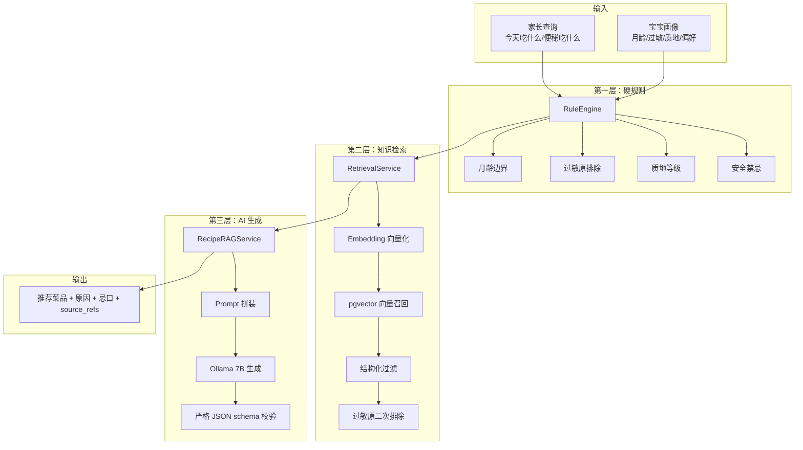

---

## 四、知识库构建数据流

### 4.1 时序图

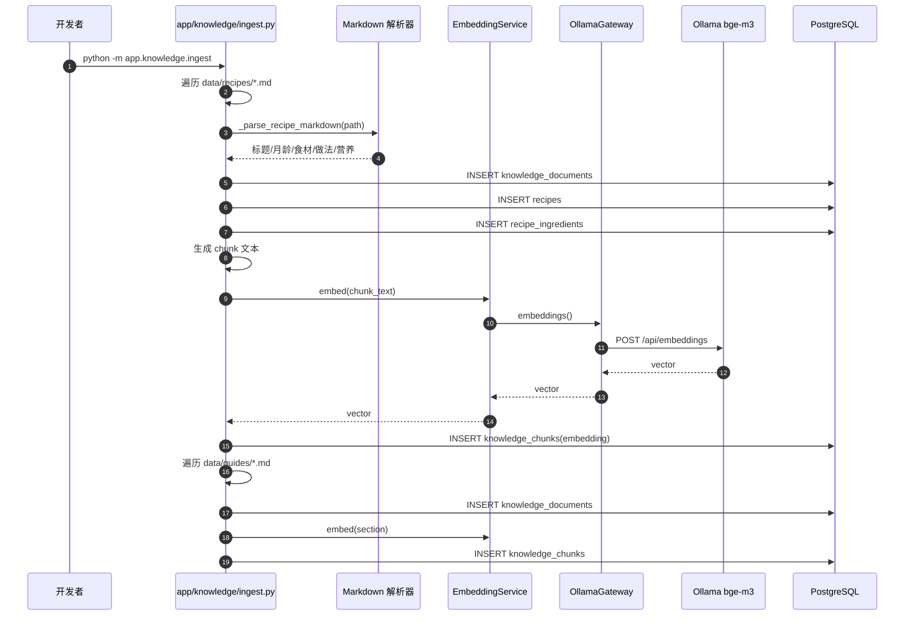

### 4.2 调用链

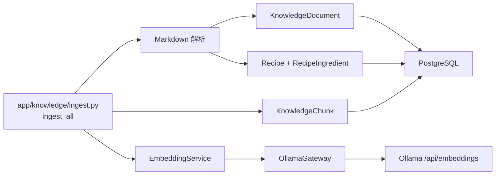

---

## 五、服务启动与初始化时序

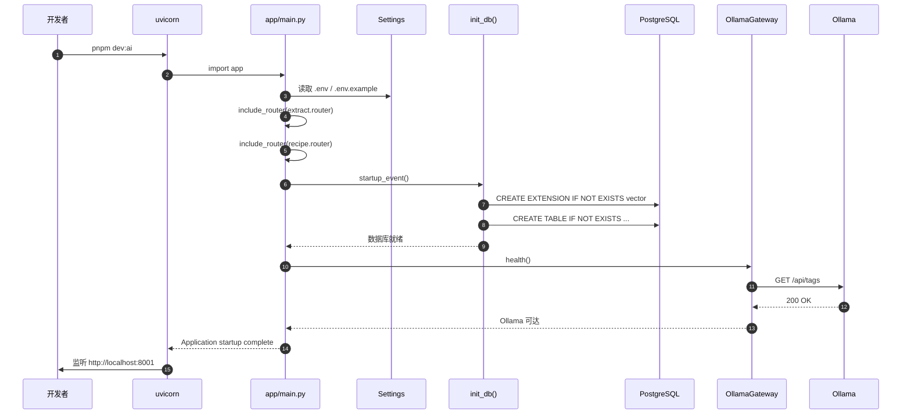

---

## 六、前端调用链路

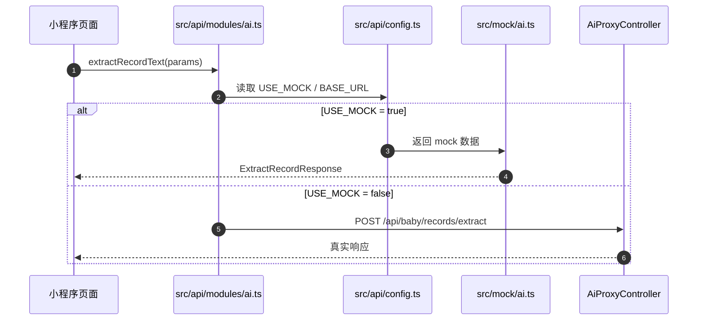

---

## 七、核心模块/类职责对照表

| 模块/类 | 路径 | 输入 | 输出 | 核心职责 |
|---------|------|------|------|----------|
| `AiProxyController` | `babyGrowBackend/.../controller` | 前端 JSON | AI 响应 | 透传、屏蔽 AI 细节 |
| `ai.ts` | `babyGrowFrontend/src/api/modules/ai.ts` | 页面参数 | Promise<响应> | 前端 AI API 封装 |
| `app/main.py` | `babyGrowAi/src/app/main.py` | HTTP 请求 | HTTP 响应 | FastAPI 入口、路由注册、启动事件 |
| `Settings` | `babyGrowAi/src/app/config.py` | `.env` | 配置对象 | 统一管理环境变量 |
| `BabyRecordExtractor` | `babyGrowAi/src/app/extractor.py` | text + age | `ExtractResponse` | 文本提取业务逻辑 |
| `RecipeRAGService` | `babyGrowAi/src/app/recipe_rag.py` | request | `RecipeRecommendResponse` | 推荐业务编排 |
| `OllamaGateway` | `babyGrowAi/src/app/services/ollama_gateway.py` | messages/schema | LLM 响应 | 模型调用 + 重试 + 流式 |
| `EmbeddingService` | `babyGrowAi/src/app/services/embedding.py` | text | vector | 生成文本向量 |
| `RetrievalService` | `babyGrowAi/src/app/services/retrieval.py` | query + 画像 | chunks | 混合检索 |
| `RuleEngine` | `babyGrowAi/src/app/services/rules.py` | age + 过敏 | rules | 硬规则过滤 |
| `ingest.py` | `babyGrowAi/src/app/knowledge/ingest.py` | Markdown | DB rows | 知识库入库 |
| `models.py` | `babyGrowAi/src/app/models.py` | - | Pydantic/SQLAlchemy | 数据结构 + ORM |
| `prompts/extraction.py` | `babyGrowAi/src/app/prompts/extraction.py` | text + age | messages | 提取 prompt |
| `prompts/recipe.py` | `babyGrowAi/src/app/prompts/recipe.py` | 画像 + context | messages | 推荐 prompt |

---

## 八、数据持久化关系

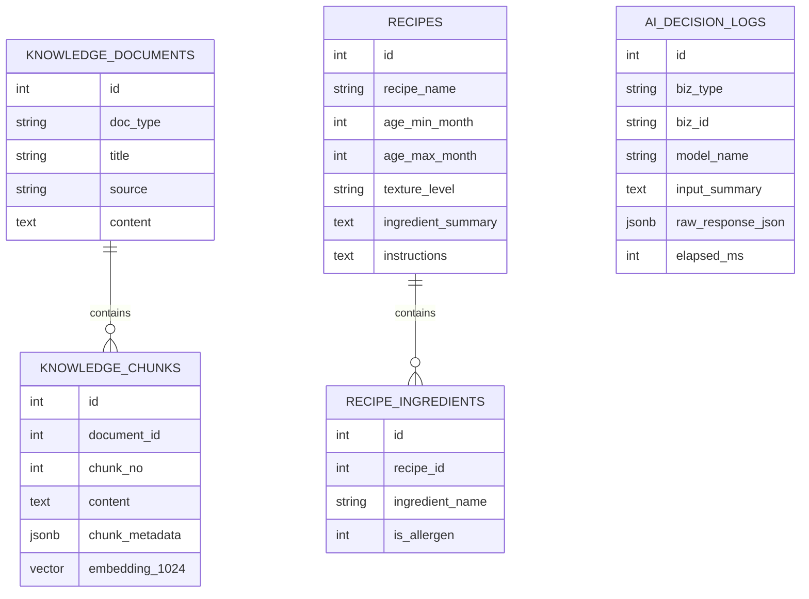

---

## 九、当前边界与未实现部分

| 层级 | 已实现 | 未实现（后续扩展） |
|------|--------|-------------------|
| 前端 | ai.ts API 模块、mock | 真实页面接入 |
| Java 后端 | 透传 Controller | 业务状态机、用户鉴权、MySQL 实体 |
| Python AI | 提取 + RAG + 知识库入库 | 图片/视频理解、月度总结、外部模型兜底、异步队列 |
| 数据库 | PostgreSQL 知识库/日志 | MySQL 业务表联动 |
| Ollama | qwen2.5:7b + bge-m3 接口 | 需用户本地拉取模型 |
| 部署 | Docker Compose 基础服务 + AI 服务 Dockerfile | 一键 make 脚本、CI/CD 流水线 |

---

> 本文档基于当前代码生成，后续随着 Phase 6+ 的演进（图片理解、月度总结、外部模型兜底、异步队列）会持续更新。
