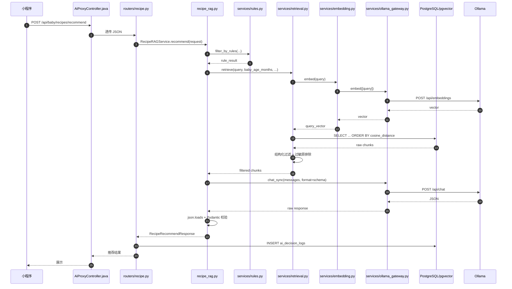
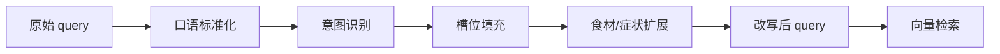
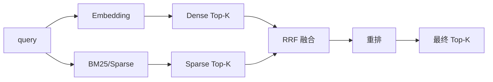
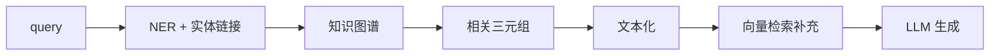
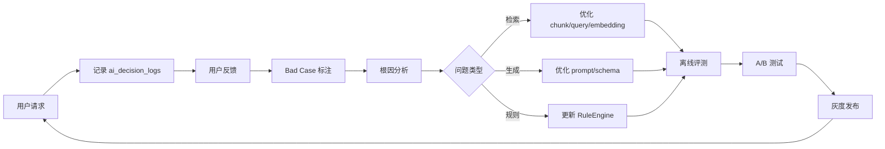

# 宝宝成长记录 · RAG 深度实战面试题（20 道·代码级详解）

> 注意：本文件内容已合并到 `ai-engineer-interview-questions-detailed.md` 第十章（121-140 题），建议直接查看主文件。
> 以下保留为独立副本，方便单独查阅 RAG 专题。

---

## 1. RAG 完整链路复盘

### 场景

你刚接手 `babyGrowAi`，需要向团队解释“一次辅食推荐请求从进来到出去，RAG 链路到底做了哪些事”。

### 问题

请画出本项目 RAG 推荐的数据流，并指出每个环节对应的真实文件和函数。

### 参考答案



**对应代码位置**：

| 步骤 | 文件 | 函数/类 |
|------|------|--------|
| 请求入口 | `babyGrowBackend/.../AiProxyController.java` | `recommendRecipes` |
| FastAPI 路由 | `babyGrowAi/src/app/routers/recipe.py` | `recommend_recipes` |
| 业务编排 | `babyGrowAi/src/app/recipe_rag.py` | `RecipeRAGService.recommend` |
| 规则过滤 | `babyGrowAi/src/app/services/rules.py` | `RuleEngine.filter_by_rules` |
| 向量检索 | `babyGrowAi/src/app/services/retrieval.py` | `RetrievalService.retrieve` |
| Embedding | `babyGrowAi/src/app/services/embedding.py` | `EmbeddingService.embed` |
| 模型网关 | `babyGrowAi/src/app/services/ollama_gateway.py` | `OllamaGateway.chat_sync` |
| Prompt | `babyGrowAi/src/app/prompts/recipe.py` | `build_recipe_prompt` |
| 数据模型 | `babyGrowAi/src/app/models.py` | `KnowledgeChunk`, `RecipeRecommendResponse` |

**踩坑点**：
- 当前 `RetrievalService.retrieve` 里 `limit(top_k * 4)` 意味着先多召回再过滤，过滤后可能不足 `top_k`。
- 过敏原过滤用 `chunk.content.lower().contains(allergen)`，会误伤“花生酱”和“花生油”同时被排除，应改用食材 NER。

---

## 2. 检索后再过滤 vs 过滤后再检索

### 场景

`RetrievalService.retrieve` 目前是“先向量召回 `top_k * 4`，再按月龄/质地/过敏原过滤”。产品经理质疑：为什么不先按条件过滤，再做向量检索？

### 问题

请比较两种顺序的优劣，并给出本项目的 hybrid 改造方案。

### 参考答案

**两种顺序对比**：

| 方案 | 优点 | 缺点 | 适用 |
|------|------|------|------|
| 先检索后过滤（当前） | 向量检索不受过滤条件稀疏影响，召回面大 | 过滤后可能不足 top_k | 过滤条件多但单条件命中少 |
| 先过滤后检索 | 召回结果直接满足硬条件 | 候选集缩小，语义相关性可能下降 | 过滤条件能建索引 |

**hybrid 改造方案**：

```python
# services/retrieval.py 改造示意
async def retrieve_hybrid(
    self,
    query: str,
    baby_age_months: int,
    allergens: list[str] | None,
    texture_level: str | None,
    top_k: int = 5,
):
    query_vector = await self.embedding_service.embed(query)

    # Step 1: 向量召回 K=50，保留语义召回能力
    candidates = (
        self.db.query(KnowledgeChunk)
        .order_by(KnowledgeChunk.embedding.cosine_distance(query_vector))
        .limit(50)
        .all()
    )

    # Step 2: 结构化过滤
    filtered = []
    for chunk in candidates:
        meta = chunk.chunk_metadata or {}
        age_min = int(meta.get("age_min_month", 0) or 0)
        age_max = int(meta.get("age_max_month", 60) or 60)
        if not (age_min <= baby_age_months <= age_max):
            continue
        if texture_level and meta.get("texture_level") and meta.get("texture_level") != texture_level:
            continue
        if allergens and any(a.lower() in chunk.content.lower() for a in allergens):
            continue
        filtered.append(chunk)

    # Step 3: 兜底重召
    if len(filtered) < top_k:
        # 放宽质地条件再次检索
        more = await self.retrieve(
            query,
            baby_age_months,
            allergens,
            texture_level=None,
            top_k=top_k * 2,
        )
        filtered.extend(more)

    return filtered[:top_k]
```

**更优方案：PostgreSQL 里把过滤 push down**

```sql
SELECT kc.*
FROM knowledge_chunks kc
JOIN recipes r ON kc.document_id = r.document_id
WHERE r.age_min_month <= :age AND r.age_max_month >= :age
  AND (:texture IS NULL OR r.texture_level = :texture)
  AND NOT EXISTS (
      SELECT 1 FROM recipe_ingredients ri
      WHERE ri.recipe_id = r.id AND LOWER(ri.ingredient_name) = ANY(:allergens)
  )
ORDER BY kc.embedding <=> :query_vector
LIMIT :limit;
```

**踩坑点**：
- 当前过敏原过滤是字符串匹配，容易误伤。应改用 `recipe_ingredients` 表关联。
- 放宽条件做兜底时，要记录日志，否则难以追踪为什么推荐不符合质地。

---

## 3. Embedding 选型：bge-m3 vs qwen2.5:7b

### 场景

团队讨论：“既然我们本地已经跑了 qwen2.5:7b，为什么不直接用它的 hidden state 做 embedding，还要再维护一个 bge-m3？”

### 问题

请从延迟、成本、质量、部署角度给出决策依据，并给出 `services/embedding.py` 的真实链路。

### 参考答案

**真实链路**：

```python
# babyGrowAi/src/app/services/embedding.py
class EmbeddingService:
    def __init__(self, gateway=None):
        self.gateway = gateway or get_model_gateway()

    async def embed(self, text: str) -> list[float]:
        results = await self.gateway.embed([text])
        return results[0]
```

`OllamaGateway.embed` 调用的是 Ollama `/api/embeddings`：

```python
# services/ollama_gateway.py 简化
async def embed(self, texts: list[str]) -> list[list[float]]:
    payload = {
        "model": get_settings().embedding_model,  # bge-m3:latest
        "input": texts,
    }
    r = await self.client.post("/api/embeddings", json=payload)
    return [item["embedding"] for item in r.json()["data"]]
```

**决策对比**：

| 维度 | bge-m3 | qwen2.5:7b 做 embedding |
|------|--------|------------------------|
| 模型大小 | ~1GB | ~5GB (q5) |
| 单条延迟 | ~20-50ms | ~200-500ms |
| 语义对齐 | 专为句子级检索训练 | 生成目标，hidden state 不一定适合 |
| 多语言 | 专门优化中英双语 | 通用，但检索非优化目标 |
| 部署成本 | 低，可和 LLM 同机 | 高，占用 GPU 显存 |
| 质量 | 通常更好 | 一般，需验证 |

**结论**：用专用 Embedding 模型。bge-m3 本项目是合理选择。

**可拓展**：
- 若未来需要多语言或跨语言检索，bge-m3 是不错的选择。
- 若需要更高精度，可尝试 bge-large-zh 或自定义微调 bge-m3。

---

## 4. pgvector 索引设计与调优

### 场景

知识库从 1000 条 chunk 增长到 100 万条，`SELECT ... ORDER BY cosine_distance` 越来越慢。

### 问题

如何为 `knowledge_chunks` 建立并调优向量索引？HNSW 参数怎么选？

### 参考答案

**当前表结构**（来自 `models.py` 推断）：

```sql
CREATE TABLE knowledge_chunks (
    id SERIAL PRIMARY KEY,
    document_id INT REFERENCES knowledge_documents(id),
    chunk_no INT,
    content TEXT,
    chunk_metadata JSONB,
    embedding VECTOR(1024)
);
```

**建索引**：

```sql
CREATE INDEX idx_knowledge_chunks_embedding
ON knowledge_chunks
USING hnsw (embedding vector_cosine_ops)
WITH (
    m = 16,                -- 每个节点最大连接数
    ef_construction = 64   -- 建索引时的搜索范围
);
```

**参数调优**：

| 参数 | 含义 | 小数据 | 大数据 |
|------|------|--------|--------|
| m | 每个节点连接数 | 8-16 | 16-32 |
| ef_construction | 建索引搜索范围 | 64-128 | 128-200 |
| ef_search | 查询搜索范围 | 64 | 100-400 |

**动态设置 ef_search**：

```sql
SET hnsw.ef_search = 200;
```

或在 SQLAlchemy 中：

```python
from sqlalchemy import text
session.execute(text("SET hnsw.ef_search = 200"))
```

**注意点**：
- `vector_cosine_ops` 对应 `<=>` cosine distance
- 不要用 `vector_l2_ops` 除非你的 embedding 训练目标是 L2
- 向量维度必须和 embedding 模型输出一致（bge-m3 默认 1024）
- 数据量小时（<1 万）， brute force 可能比 HNSW 还快

---

## 5. Chunking 策略与上下文断裂

### 场景

你发现按 Markdown 章节切分后，召回的“食材”chunk 里没有“适合月龄”信息，导致模型推荐不适合当前宝宝的菜品。

### 问题

请设计一个适合本项目的 chunking 策略，并给出 `ingest.py` 中的伪代码改造。

### 参考答案

**问题分析**：

按章节切分导致：
- chunk A: “食材：南瓜 50g，小米 30g”
- chunk B: “做法：...”
- chunk C: “适合 8-10 个月”

单独检索到 A 时，不知道适合月龄。

**改造方案：Parent Document Retrieval + Metadata 注入**

```python
# ingest.py 改造示意
from app.models import KnowledgeDocument, KnowledgeChunk

def make_chunks_with_parent(doc: KnowledgeDocument, recipe):
    sections = parse_markdown_sections(doc.content)
    chunks = []
    for i, section in enumerate(sections):
        # 每个 chunk 继承全局 metadata
        metadata = {
            "doc_type": "recipe",
            "age_min_month": recipe.age_min_month,
            "age_max_month": recipe.age_max_month,
            "texture_level": recipe.texture_level,
            "allergens": recipe.allergens,
            "section": section.title,
        }
        chunks.append(KnowledgeChunk(
            document_id=doc.id,
            chunk_no=i,
            content=section.text,
            chunk_metadata=metadata,
        ))
    return chunks
```

**检索时返回 parent 内容**：

```python
# services/retrieval.py
async def retrieve_with_parent(self, query, baby_age_months, top_k=5):
    query_vec = await self.embedding_service.embed(query)
    chunks = (
        self.db.query(KnowledgeChunk)
        .order_by(KnowledgeChunk.embedding.cosine_distance(query_vec))
        .limit(top_k * 2)
        .all()
    )

    # 去重 parent，避免同一篇文档出现多次
    parent_ids = set()
    results = []
    for chunk in chunks:
        if chunk.document_id in parent_ids:
            continue
        parent_ids.add(chunk.document_id)
        doc = self.db.query(KnowledgeDocument).get(chunk.document_id)
        results.append({
            "chunk": chunk,
            "parent_content": doc.content,  # 完整食谱
        })
        if len(results) >= top_k:
            break
    return results
```

**送给 LLM 的 context**：

```python
context = "\n\n".join([
    f"【来源：{r['chunk'].chunk_metadata.get('section')}\n{r['parent_content'][:800]}"
    for r in results
])
```

**踩坑点**：
- parent 文档可能很长，容易超上下文窗口，需要截断或摘要。
- 同一 parent 的多个 chunk 不要都拿 parent，否则 context 重复。

---

## 6. Query Rewriting 与扩展

### 场景

家长输入“娃这两天拉不出”，向量检索召回的 chunk 相关性很低。

### 问题

如何设计一个 query rewriting 层？给出完整实现思路。

### 参考答案

**链路设计**：



**实现代码**：

```python
# services/query_rewriter.py
class QueryRewriter:
    def __init__(self, gateway):
        self.gateway = gateway

    async def rewrite(self, raw: str, baby_age_months: int) -> str:
        # 1. 口语标准化 + 同义词
        normalized = self._normalize(raw)

        # 2. 用 LLM 扩展食材关键词
        expanded = await self._expand_with_llm(normalized)

        # 3. 拼接宝宝画像
        final = f"{baby_age_months}个月宝宝 {expanded} 辅食推荐"
        return final

    def _normalize(self, raw: str) -> str:
        mapping = {
            "拉不出": "便秘",
            "屙不出": "便秘",
            "不吃": "不喜欢",
            "娃": "宝宝",
        }
        for k, v in mapping.items():
            raw = raw.replace(k, v)
        return raw

    async def _expand_with_llm(self, normalized: str) -> str:
        prompt = f"""
        用户 query：{normalized}
        请扩展出相关的食材、症状、营养素关键词，用空格分隔。
        只输出关键词，不要解释。
        """
        r = await self.gateway.chat_sync([{"role": "user", "content": prompt}])
        return r["message"]["content"]
```

**调用位置**：

```python
# recipe_rag.py
rewritten = await query_rewriter.rewrite(request.query, request.baby_age_months)
retrieved = await self.retrieval_service.retrieve(
    query=rewritten,
    baby_age_months=request.baby_age_months,
    ...
)
```

**注意点**：
- LLM 扩展增加一次调用，延迟 +100-300ms。
- 对于高频 query，可预计算改写结果并缓存。
- 扩展后的 query 变长，可能影响 embedding 质量，要做评测。

---

## 7. Hybrid Search：Dense + BM25 融合

### 场景

家长搜“红薯”，Dense 检索召回“马铃薯泥”，关键词检索又会召回一堆“红薯”相关但不适合宝宝月龄的网页。

### 问题

如何在本项目实现 Dense + Sparse Hybrid Search？给出完整代码结构。

### 参考答案

**整体架构**：



**实现方案**：

```python
# services/hybrid_retrieval.py
from collections import defaultdict

class HybridRetrievalService:
    def __init__(self, db, embedding_service, bm25_service):
        self.db = db
        self.embedding_service = embedding_service
        self.bm25_service = bm25_service

    async def search(self, query: str, baby_age_months: int, top_k: int = 5):
        # 1. Dense 检索
        dense = await self._dense_search(query, top_k * 3)

        # 2. Sparse/BM25 检索
        sparse = await self._bm25_search(query, top_k * 3)

        # 3. RRF 融合
        merged = self._rrf_merge([dense, sparse], k=60)

        # 4. 结构化过滤
        filtered = self._filter_by_rules(merged, baby_age_months)

        return filtered[:top_k]

    async def _dense_search(self, query, top_k):
        vec = await self.embedding_service.embed(query)
        return (
            self.db.query(KnowledgeChunk)
            .order_by(KnowledgeChunk.embedding.cosine_distance(vec))
            .limit(top_k)
            .all()
        )

    async def _bm25_search(self, query, top_k):
        # PostgreSQL 需要安装 pg_bm25 扩展，或使用外部 Elasticsearch
        return await self.bm25_service.search(query, top_k)

    def _rrf_merge(self, result_lists, k=60):
        scores = defaultdict(float)
        docs = {}
        for results in result_lists:
            for rank, doc in enumerate(results, start=1):
                doc_id = doc.id
                scores[doc_id] += 1.0 / (k + rank)
                docs[doc_id] = doc
        ranked = sorted(scores.items(), key=lambda x: x[1], reverse=True)
        return [docs[doc_id] for doc_id, _ in ranked]
```

**PostgreSQL pg_bm25 扩展方案**：

```sql
-- 需要安装 pg_bm25（ParadeDB）
CREATE INDEX idx_content_bm25
ON knowledge_documents
USING bm25 (content, title)
WITH (key_field='id');

SELECT id, title, content, paradedb.score(id) as score
FROM knowledge_documents
WHERE content @@@ '红薯'
ORDER BY score DESC
LIMIT 10;
```

**如果不用 pg_bm25，可用 Python whoosh/elasticsearch**：

```python
from whoosh.index import open_dir
from whoosh.qparser import QueryParser

ix = open_dir("indexdir")
with ix.searcher() as searcher:
    q = QueryParser("content", ix.schema).parse("红薯")
    results = searcher.search(q, limit=10)
```

**踩坑点**：
- BM25 对中文分词要求高，要先用 jieba 分词。
- Dense 和 BM25 的 Top-K 取值不同，融合前要确保单位一致。
- 建议先做离线评测，比较 Dense / Sparse / Hybrid 的 Recall@K。

---

## 8. Re-ranking 与 Cross-Encoder

### 场景

向量召回 Top-5 中，第 2、3 条明显比第 1 条更相关，但双塔模型无法判断。

### 问题

如何引入 Cross-Encoder 做重排序？给出部署和调用方案。

### 参考答案

**为什么需要重排**：

双塔 Embedding 独立编码 query 和 doc，无法做 token 级精细交互。Cross-Encoder 把 query 和 doc 一起输入，能做更精确的相关性判断。

**伪代码**：

```python
# services/reranker.py
class CrossEncoderReranker:
    def __init__(self):
        # 使用 bge-reranker 或自己微调的模型
        self.model = load_model("BAAI/bge-reranker-base")

    async def rerank(self, query: str, chunks: list, top_k: int = 5) -> list:
        pairs = [(query, chunk.content) for chunk in chunks]
        scores = self.model.predict(pairs)
        for chunk, score in zip(chunks, scores):
            chunk.rerank_score = score
        return sorted(chunks, key=lambda x: x.rerank_score, reverse=True)[:top_k]
```

**接入 RAG 链路**：

```python
# recipe_rag.py
async def recommend(self, request):
    # 1. 粗排召回 Top-20
    candidates = await self.retrieval_service.retrieve(
        query=request.query,
        baby_age_months=request.baby_age_months,
        top_k=20,
    )

    # 2. Cross-encoder 精排
    reranked = await self.reranker.rerank(
        request.query, candidates, top_k=5
    )

    # 3. 生成
    context = "\n\n".join([c.content for c in reranked])
    ...
```

**部署注意**：
- Cross-encoder 计算量大，只对 Top-20/50 做重排。
- 可使用 ONNX/TensorRT 加速。
- 本地 GPU 推荐，CPU 会显著增加延迟。

---

## 9. 增量更新与版本控制

### 场景

`data/recipes/` 新增了一篇 `牛肉蔬菜粥.md`，要求不重新全量 ingest，只更新新增文档。

### 问题

如何设计增量更新机制？如何保留版本便于回滚？

### 参考答案

**数据表设计**：

```sql
CREATE TABLE knowledge_documents (
    id SERIAL PRIMARY KEY,
    doc_type VARCHAR(50),
    title VARCHAR(255),
    source_path VARCHAR(500),
    content_hash VARCHAR(64),  -- sha256
    version INT DEFAULT 1,
    created_at TIMESTAMP,
    updated_at TIMESTAMP
);
```

**增量更新流程**：

```python
# services/ingestion.py
import hashlib
from pathlib import Path

class IncrementalIngester:
    def __init__(self, db):
        self.db = db

    async def ingest_file(self, path: str):
        path = Path(path)
        content = path.read_text(encoding="utf-8")
        new_hash = hashlib.sha256(content.encode()).hexdigest()

        doc = self.db.query(KnowledgeDocument).filter_by(source_path=str(path)).first()

        if doc and doc.content_hash == new_hash:
            print(f"无变化：{path}")
            return

        if doc:
            # 删除旧 chunk
            self.db.query(KnowledgeChunk).filter_by(document_id=doc.id).delete()
            doc.content_hash = new_hash
            doc.version += 1
            doc.updated_at = now()
        else:
            doc = KnowledgeDocument(
                title=extract_title(content),
                source_path=str(path),
                content_hash=new_hash,
                version=1,
            )
            self.db.add(doc)
            self.db.flush()

        # 重新切分、embedding、插入
        chunks = chunk_and_embed(content, doc.id)
        for c in chunks:
            self.db.add(c)
        self.db.commit()

        print(f"已更新：{path} (v{doc.version})")
```

**版本回滚**：

```python
async def rollback_document(source_path: str, version: int):
    doc = self.db.query(KnowledgeDocument).filter_by(
        source_path=source_path, version=version
    ).first()
    if not doc:
        raise ValueError("版本不存在")

    # 恢复该版本的 chunks
    self.db.query(KnowledgeChunk).filter_by(document_id=doc.id).delete()
    ...
```

**注意点**：
- 删除 chunk 后要刷新 HNSW 索引，否则索引中存在无效向量。
- 大批量更新建议用事务，避免中间状态被查询到。

---

## 10. 多轮对话 RAG

### 场景

家长先问“8个月便秘”，再问“那明天呢？”。当前系统把“明天呢？”当独立 query 处理，召回结果很差。

### 问题

如何设计多轮对话 RAG？给出对话管理和指代消解方案。

### 参考答案

**数据模型**：

```python
# models.py
class Conversation(Base):
    __tablename__ = "conversations"
    id = Column(String, primary_key=True)
    user_id = Column(String, index=True)
    created_at = Column(DateTime)

class ConversationMessage(Base):
    __tablename__ = "conversation_messages"
    id = Column(Integer, primary_key=True)
    conversation_id = Column(String, index=True)
    role = Column(String)
    content = Column(Text)
    created_at = Column(DateTime)
```

**指代消解 + Query 改写**：

```python
# services/conversation.py
async def resolve_query(conversation_id: str, current_query: str) -> str:
    history = get_recent_history(conversation_id, limit=5)

    prompt = f"""
    历史对话：
    {format_history(history)}

    当前输入：{current_query}

    请把当前输入补全为一个独立的查询句，不要丢失宝宝月龄、症状等关键信息。
    只输出补全后的查询句。
    """

    response = await gateway.chat_sync([
        {"role": "user", "content": prompt}
    ])
    return response["message"]["content"].strip()
```

**调用位置**：

```python
# routers/recipe.py
resolved = await conversation_service.resolve_query(
    request.conversation_id, request.query
)
result = await recipe_service.recommend(
    request.copy(update={"query": resolved})
)
```

**注意点**：
- 历史不要无限增长，保留最近 3-5 轮即可。
- 对历史做摘要可进一步减少上下文长度。
- 多轮对话中的“不喜欢”也要累积到宝宝画像。

---

## 11. 检索评估：Recall、Precision、NDCG

### 场景

产品要求你评估 RAG 检索效果，但你只有 50 条人工标注的 `(query, relevant_chunk_ids)`。

### 问题

如何设计离线评测？请给出代码框架。

### 参考答案

```python
# eval/retrieval_eval.py
from collections import defaultdict

class RetrievalEvaluator:
    def __init__(self, retrieval_service):
        self.retrieval_service = retrieval_service

    async def evaluate(self, test_set: list[dict], top_k: int = 5) -> dict:
        """
        test_set: [{"query": str, "baby_age": int, "relevant_ids": [int]}]
        """
        metrics = {"recall": [], "precision": [], "ndcg": [], "mrr": []}

        for case in test_set:
            results = await self.retrieval_service.retrieve(
                query=case["query"],
                baby_age_months=case["baby_age"],
                top_k=top_k,
            )
            retrieved_ids = {r["id"] for r in results}
            relevant_ids = set(case["relevant_ids"])

            # Recall@K
            recall = len(retrieved_ids & relevant_ids) / len(relevant_ids)
            metrics["recall"].append(recall)

            # Precision@K
            precision = len(retrieved_ids & relevant_ids) / len(retrieved_ids)
            metrics["precision"].append(precision)

            # MRR
            mrr = 0.0
            for rank, r in enumerate(results, start=1):
                if r["id"] in relevant_ids:
                    mrr = 1.0 / rank
                    break
            metrics["mrr"].append(mrr)

        return {k: sum(v) / len(v) for k, v in metrics.items()}
```

**测试集构建**：

```python
TEST_SET = [
    {
        "query": "8个月宝宝便秘吃什么",
        "baby_age": 8,
        "relevant_ids": [12, 34, 56],  # 营养师标注
    },
]
```

**注意点**：
- 标注应由营养师或产品专家完成。
- 每个 query 至少覆盖：月龄、症状、过敏原等维度。
- 定期用线上 bad case 补充测试集。

---

## 12. RAG 失败模式诊断

### 场景

家长问“6个月宝宝可以吃芒果吗？”，系统推荐了芒果。

### 问题

请给出完整的诊断清单和修复方案。

### 参考答案

**诊断清单**：

```python
async def diagnose_recipe_recommendation(query, baby_age, result):
    print("=== RAG 诊断 ===")

    # 1. 检索阶段
    chunks = await retrieval_service.retrieve(query, baby_age)
    print(f"召回 chunks: {len(chunks)}")
    for c in chunks:
        print(f"  - {c['id']}: {c['content'][:80]}...")

    # 2. 规则阶段
    rule_result = rule_engine.filter_by_rules(baby_age=baby_age)
    print(f"规则 avoid: {rule_result.get('avoid_items')}")

    # 3. Prompt 阶段
    messages = build_recipe_prompt(...)
    print(f"system prompt 长度: {len(messages[0]['content'])}")

    # 4. 输出阶段
    print(f"推荐菜品: {[i.dish_name for i in result.items]}")
    print(f"avoid_items: {result.avoid_items}")

    # 判断：芒果是否在 avoid_items 中？是否在知识库中被标记为高敏？
```

**修复方案**：

1. **规则层**：把芒果加入 6 个月高风险食材
2. **检索层**：确保高敏提示 chunk 被召回（可用 query 扩展）
3. **Prompt 层**：强化“6个月谨慎引入新食材”的提示
4. **后处理层**：用食材白名单校验推荐结果

---

## 13. Query Decomposition

### 场景

家长输入“宝宝便秘但不爱吃青菜，能吃点什么？”

### 问题

如何把复杂 query 拆成多个子检索？

### 参考答案

```python
# services/query_decomposer.py
async def decompose(query: str) -> list[str]:
    prompt = f"""
    把家长的复杂需求拆成多个独立的检索子问题。
    每个子问题只包含一个意图或约束。

    示例：
    输入：8个月宝宝便秘但不爱吃青菜，能吃点什么？
    输出：
    1. 8个月宝宝便秘吃什么辅食
    2. 不含青菜的高纤维辅食
    """
    response = await gateway.chat_sync([{"role": "user", "content": prompt}])
    return parse_numbered_list(response["message"]["content"])

async def multi_query_retrieve(query, request):
    sub_queries = await decompose(query)
    all_chunks = []
    for q in sub_queries:
        chunks = await retrieval_service.retrieve(
            q, request.baby_age_months
        )
        all_chunks.extend(chunks)

    # 去重 + 重排
    return deduplicate_and_rerank(all_chunks)
```

---

## 14. 多语言/跨语言 RAG

### 场景

团队想支持英文 query 检索中文知识库。

### 问题

如何实现？

### 参考答案

**方案 1：多语言 Embedding**

bge-m3 本身支持多语言，直接把英文 query 和中文文档映射到同一向量空间。

```python
vec_en = await embed("constipation food for 8 month baby")
vec_zh = await embed("8个月宝宝便秘辅食")
# 两者在同一空间
```

**方案 2：查询翻译**

```python
async def translate_to_zh(query: str) -> str:
    prompt = f"把以下英文翻译成中文：{query}"
    r = await gateway.chat_sync([{"role": "user", "content": prompt}])
    return r["message"]["content"]
```

**方案 3：文档翻译**

把中文知识库翻译成英文存储，或存储双语 chunk。

**推荐**：先用方案 1 验证，如果效果不好再用方案 2 兜底。

---

## 15. 冷启动与热门推荐

### 场景

新用户没有历史饮食记录，系统第一次推荐不知道从何下手。

### 问题

如何设计冷启动策略？

### 参考答案

```python
async def cold_start_recommend(baby_age_months: int):
    # 1. 按月龄推荐入门食谱
    if baby_age_months <= 6:
        return ["强化铁米粉", "南瓜泥"]
    elif baby_age_months <= 9:
        return ["燕麦香蕉泥", "胡萝卜泥"]
    else:
        return ["软烂面条", "蛋黄羹"]
```

**同时收集画像**：

- 首次使用询问：过敏史、偏好、当前喂养情况
- 把信息写入 `baby_profiles` 表

---

## 16. 食材白名单与幻觉检测

### 场景

模型推荐的 ingredients 里出现了知识库没有的食材“鳕鱼”。

### 问题

如何检测和防止？

### 参考答案

```python
# services/hallucination_guard.py
async def check_ingredients(result: RecipeRecommendResponse, db):
    whitelist = {row.ingredient_name for row in db.query(RecipeIngredient)}

    for item in result.items:
        unknown = [ing for ing in item.ingredients if ing not in whitelist]
        if unknown:
            raise HallucinationError(
                f"菜品 {item.dish_name} 包含未知食材: {unknown}"
            )
```

**接入 recipe_rag.py**：

```python
result = await self.gateway.chat_sync(messages, format=schema)
parsed = json.loads(result["message"]["content"])
items = [...]

# 后处理校验
check_ingredients(
    RecipeRecommendResponse(items=items, ...), self.db
)
```

---

## 17. RAG 与知识图谱结合

### 场景

你想让系统不仅能推荐食谱，还能回答“猪肉和什么搭配补铁”。

### 问题

如何引入知识图谱？

### 参考答案



**示例图谱**：

```python
# 三元组
TRIPLES = [
    ("牛肉", "富含", "铁"),
    ("番茄", "促进吸收", "铁"),
    ("牛肉番茄", "适合", "补铁"),
]
```

**落地方式**：
- 用 Neo4j 存储关系
- 检索时先查图谱，把相关三元组文本化后拼入 prompt
- 仍用向量检索补充具体食谱

---

## 18. RAG 中的缓存设计

### 场景

“8个月便秘吃什么”是高频 query，每次都调用 Ollama 很浪费。

### 问题

如何设计缓存？

### 参考答案

```python
# services/recipe_cache.py
import hashlib
import json

class RecipeCache:
    def __init__(self, redis_client):
        self.redis = redis_client

    def _key(self, request):
        # 用请求参数生成稳定 key
        payload = {
            "age": request.baby_age_months,
            "query": request.query,
            "allergens": sorted(request.allergens or []),
            "texture": request.texture_level,
        }
        return "recipe:" + hashlib.sha256(
            json.dumps(payload, sort_keys=True).encode()
        ).hexdigest()

    async def get(self, request):
        key = self._key(request)
        cached = await self.redis.get(key)
        if cached:
            return json.loads(cached)
        return None

    async def set(self, request, result, ttl=300):
        key = self._key(request)
        await self.redis.setex(key, ttl, json.dumps(result, default=str))
```

**注意点**：
- 缓存 key 不要包含用户 ID，否则命中率低。
- 过敏原顺序要排序后生成 key。
- 缓存时间不要太长，知识库更新后要及时失效。

---

## 19. RAG 持续优化闭环

### 场景

上线后推荐质量波动，你需要建立数据飞轮。

### 问题

如何设计 RAG 的持续优化闭环？

### 参考答案



**关键表设计**：

```sql
CREATE TABLE feedback_logs (
    id SERIAL PRIMARY KEY,
    request_id VARCHAR(64),
    user_id VARCHAR(64),
    label VARCHAR(20),      -- good / bad / neutral
    reason TEXT,            -- 口味、过敏、重复、不准...
    created_at TIMESTAMP
);
```

**每周自动化报告**：

```python
async def weekly_bad_case_report():
    rows = db.query("""
        SELECT reason, COUNT(*) as cnt
        FROM feedback_logs
        WHERE created_at > NOW() - INTERVAL '7 days'
        GROUP BY reason
        ORDER BY cnt DESC
    """)
    return rows
```

---

## 20. RAG 系统 ROI 评估

### 场景

老板问：投入这么多做 RAG，到底值不值？

### 问题

如何量化 RAG 改动的业务价值？

### 参考答案

**核心公式**：

```
价值 = （推荐采纳率提升 × 活跃用户数 × 客单价）
    - （开发成本 + 推理成本 + 运维成本）
```

**需要收集的数据**：

| 指标 | 来源 |
|------|------|
| 推荐采纳率 | 前端埋点 |
| 用户留存 | 业务数据库 |
| 平均响应时间 | `ai_decision_logs` |
| 单次推理成本 | Ollama 调用次数 × 单价 |
| 营养师人工成本 | 审核工时 |

**A/B 测试设计**：

```python
# 按 user_id 分桶
def select_group(user_id: str) -> str:
    h = int(hashlib.md5(user_id.encode()).hexdigest(), 16) % 100
    return "treatment" if h < 50 else "control"
```

**结论输出示例**：

```
新版本：推荐采纳率 42% → 48%（+6pp）
      平均响应时间 1.2s → 0.9s
      周推理成本增加 200 元
      ROI = 3.2x
```

---

> 本深度实战篇共 20 题，覆盖 RAG 链路、检索策略、Embedding、Chunking、Hybrid Search、Re-ranking、增量更新、多轮对话、评估、缓存、持续优化与 ROI。每题均给出 `baby-grow` 项目中可落地的代码、流程图与踩坑点。
