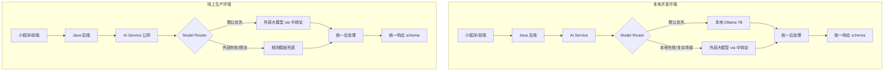

# AI 模型路由策略：本地 Ollama 与线上外部大模型统一方案

> 本文档记录 `baby-grow` 项目中本地小模型与线上外部大模型协同使用的工程实践。
> 目标：在本地开发优先使用 Ollama 省钱，线上生产默认调用外部大模型保证稳定，二者通过统一接口和后处理对外保持一致。

---

## 一、核心结论

**不要追求本地小模型与线上大模型“推理过程一致”，而要保证：**

1. 统一输入输出 schema
2. 统一安全后处理（过敏原、月龄禁忌）
3. 统一知识库来源（RAG chunks）
4. 统一日志与监控

这样即使底层模型不同，小程序侧和家长感知到的推荐效果也是可控、可对比、可回滚的。

---

## 二、推荐架构



---

## 三、本地 vs 线上的路由策略

| 环境 | 默认模型 | 失败 fallback | 设计意图 |
|------|---------|--------------|---------|
| 本地开发 | 本地 Ollama 7B | 外部大模型 via 中转站 | 省钱、快速迭代、数据不出域 |
| 线上生产 | 外部大模型 via 中转站 | 规则模板兜底 | 稳定、能力强、可访问 |

---

## 四、中转站（API 代理网关）设计

### 作用

- 聚合多个模型厂商 API（OpenAI、Claude、DeepSeek、通义、文心等）
- 统一鉴权、限流、日志、监控
- 按模型/成本/质量做负载均衡和 fallback
- 隐藏真实 API Key，便于团队管理

### 推荐方案

| 方案 | 说明 | 推荐 |
|------|------|------|
| One API | 开源，OpenAI 格式兼容，易部署 | 中小型项目首选 |
| LiteLLM | 更工程化，支持 fallback、rate limit、OpenTelemetry | 大型/多模型项目 |
| 自建 Nginx + 后端 | 完全可控，但开发成本高 | 有专门网关团队时 |

---

## 五、关键代码结构

### 5.1 Model Router

```python
# services/model_router.py
import os
from enum import Enum

class Environment(str, Enum):
    LOCAL = "local"
    DEV = "development"
    PROD = "production"

class ModelRouter:
    def __init__(self):
        self.env = Environment(os.getenv("APP_ENV", "local"))
        self.ollama = OllamaGateway()
        self.cloud = CloudGateway()
        self.template = TemplateFallback()

    async def recommend(self, request):
        if self.env in (Environment.LOCAL, Environment.DEV):
            return await self._local_first(request)
        return await self._cloud_first(request)

    async def _local_first(self, request):
        try:
            return "local", await self.ollama.recommend(request)
        except Exception as e:
            logger.warning(f"本地模型失败，转外部: {e}")
            return "cloud", await self.cloud.recommend(request)

    async def _cloud_first(self, request):
        try:
            return "cloud", await self.cloud.recommend(request)
        except Exception as e:
            logger.error(f"外部模型失败，使用兜底: {e}")
            return "template", self.template.recommend(request)
```

### 5.2 外部模型网关（通过中转站）

```python
# services/cloud_gateway.py
import httpx
from app.config import get_settings

class CloudGateway:
    def __init__(self):
        settings = get_settings()
        self.base_url = settings.proxy_base_url
        self.api_key = settings.proxy_api_key
        self.model = settings.proxy_model

    async def recommend(self, request):
        messages = build_recipe_prompt(request)
        async with httpx.AsyncClient(timeout=30) as client:
            r = await client.post(
                f"{self.base_url}/chat/completions",
                headers={"Authorization": f"Bearer {self.api_key}"},
                json={
                    "model": self.model,
                    "messages": messages,
                    "temperature": 0.2,
                },
            )
            r.raise_for_status()
            return parse_response(r.json())
```

---

## 六、环境变量配置

### 6.1 本地开发 `.env.local`

```bash
APP_ENV=local

OLLAMA_BASE_URL=http://host.docker.internal:11434
OLLAMA_MODEL=qwen2.5:7b-instruct-q5_K_M
EMBEDDING_MODEL=bge-m3:latest

# 本地失败时启用
PROXY_BASE_URL=http://localhost:3000/v1
PROXY_API_KEY=sk-local-test
PROXY_MODEL=deepseek-chat
```

### 6.2 线上生产 `.env.prod`

```bash
APP_ENV=production

# Ollama 仅作为备用
OLLAMA_BASE_URL=http://ollama:11434

# 生产默认走中转站
PROXY_BASE_URL=https://your-proxy-domain.com/v1
PROXY_API_KEY=sk-prod-xxx
PROXY_MODEL=gpt-4o-mini
PROXY_FALLBACK_MODEL=deepseek-chat
```

### 6.3 docker-compose 配置

本地：

```yaml
services:
  ai-service:
    build: ./babyGrowAi
    environment:
      - APP_ENV=local
      - OLLAMA_BASE_URL=http://host.docker.internal:11434
      - PROXY_BASE_URL=${PROXY_BASE_URL}
      - PROXY_API_KEY=${PROXY_API_KEY}
    extra_hosts:
      - "host.docker.internal:host-gateway"
```

生产：

```yaml
services:
  ai-service:
    build: ./babyGrowAi
    environment:
      - APP_ENV=production
      - PROXY_BASE_URL=${PROXY_BASE_URL}
      - PROXY_API_KEY=${PROXY_API_KEY}
      - PROXY_MODEL=gpt-4o-mini
```

---

## 七、关键注意点

### 7.1 本地 Ollama Docker 访问

Docker 容器访问宿主机 Ollama：

```yaml
extra_hosts:
  - "host.docker.internal:host-gateway"
```

`OLLAMA_BASE_URL=http://host.docker.internal:11434`

### 7.2 统一 JSON schema

无论本地还是云端，强制模型输出同一 schema，并用 Pydantic 校验：

```python
schema = {
    "type": "object",
    "additionalProperties": False,
    "properties": {
        "summary": {"type": "string"},
        "items": {
            "type": "array",
            "minItems": 1,
            "maxItems": 3,
            "items": {
                "type": "object",
                "additionalProperties": False,
                "properties": {
                    "mealType": {"type": "string"},
                    "dishName": {"type": "string"},
                    "reason": {"type": "string"},
                    "ingredients": {"type": "array", "items": {"type": "string"}},
                },
                "required": ["mealType", "dishName", "reason", "ingredients"],
            },
        },
        "avoidItems": {"type": "array", "items": {"type": "string"}},
        "reason": {"type": "string"},
        "confidence": {"type": "number"},
    },
    "required": ["summary", "items", "avoidItems", "reason", "confidence"],
}
```

### 7.3 统一后处理

```python
async def post_process(result, request):
    validate_allergens(result, request.allergens)
    validate_disliked(result, request.disliked_foods)
    validate_ingredient_whitelist(result)
    return result
```

### 7.4 Shadow Test / A/B Test

上线前对比本地/云端模型差异：

```python
async def shadow_test(request):
    local_result = await ollama.recommend(request)
    cloud_result = await cloud.recommend(request)
    db.insert_shadow_diff(request, local_result, cloud_result)
```

### 7.5 成本与效果监控

```python
db.log_model_call(
    env=settings.app_env,
    source="cloud",
    model="gpt-4o-mini",
    latency_ms=1200,
    input_tokens=1500,
    output_tokens=300,
    cost_usd=0.002,
)
```

---

## 八、实施 checklist

- [ ] 搭建本地 Ollama + bge-m3 开发环境
- [ ] 部署中转站（One API / LiteLLM），接入至少一个外部模型
- [ ] 实现 `CloudGateway` 统一调用外部模型
- [ ] 实现环境感知的 `ModelRouter`
- [ ] 定义统一的 JSON schema 和 Pydantic 校验
- [ ] 实现统一后处理（过敏原、不喜欢食材、白名单）
- [ ] 配置 `.env.local` 和 `.env.prod`
- [ ] 配置 `docker-compose.local.yml` 和 `docker-compose.prod.yml`
- [ ] 实现规则模板兜底
- [ ] 接入 Shadow Test / A/B Test
- [ ] 配置日志与监控

---

## 九、一句话总结

> 本地开发优先 Ollama 省钱，线上生产默认外部大模型保稳定；小程序只访问公网后端；外部模型通过中转站统一接入；统一 schema、统一后处理、统一日志，让小模型和大模型在工程上“看起来一致”。
